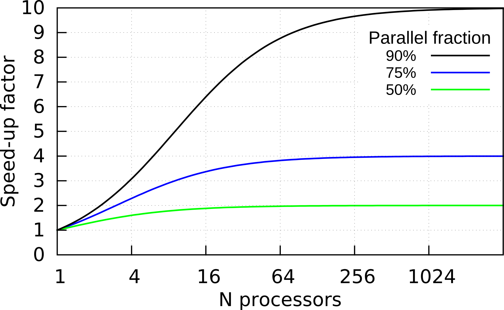

# Compile and run instructions

## Para ejecutar CountThread: 
mvn exec:java -Dexec.mainClass="edu.escuelaing.arsw.lab01CaycedoOspina.threads.CountThreadMain"

## Para ejecutar PiDigits: 
mvn exec:java -Dexec.mainClass="edu.escuelaing.arsw.lab01CaycedoOspina.math.Main"

## Para ejecutar las pruebas: 
mvn test

# Part I - Introduction to Java Threads

Se creo tres instancias de threads los cuales tenian diferentes rangos de datos

Los resultados de las 3 implementaciones es el sigueinte, con el metodo Start():

Los resultados de las 3 implementaciones es el sigueinte, con el metodo Run():

La salida cambia debido a que en el caso de metodo run en ningun momento s einicializan 
los threads dando asi la ejecucion de un metodo el cual contiene un ciclo hasta terminar 
su tarea. En cambio con Strat() al inicalizarce los threads cada uno tiene un tiempo 
determinado de ejecucion.

# Part II - BBP Formula Exercise

La paralelización se realizo mediante un thread el cual llamaba la funicion Pidigit.getDigit()
un numeor de veces dependiendo de cuantos threads se queria realizar. El metodo en cargado de realizar 
la particion se encuentra en la clase PiDigit como calcularThread el cual recibe como parametros el numero de thread,
el comienzo y los numeros que se van a definir.

# Part III - Performance Evaluation
Debido al tiempo de ejecucion del 1'000.000 se paso a realizar los sigueintes ejemplos con 100.000
## Single thread. 

### Tiempo: 
2.1326164 sec.

## As many threads as processing cores. 

### Tiempo: 
1.1383019 sec.

## So many threads as double processing cores. 

### Tiempo: 
0.9916208 sec.

## 200 threads.

### Tiempo: 
0.6210134 sec.

## 500 threads.

### Tiempo: 
1.37616 sec.

1. el mejo tiempo que da el ejercicio es con 200 threads, una de las razones es que al tener mayor cantidad de 
hilos deben pasar a utilizarse mas recursos para poder sincronizarce por lo que se puede esperar que entre mas threads se usen
despues de cierta cantidad el rendimiento decae.

2. debido a que por cada procesador se tiene dos hilos el trabajo que tiene que realizar es muy poco,
por lo cual si se tiene gran cantidad de hilos pro precesador mejorara el rendimiento a medida que se aumenten los 
threads.

3. Como se puede ver en la grafica a partir de una cierta cantidad de threads el rendimiento no crece a razon costante por lo que se 
puede decir es que a medida que se usan mas recursos el redmiento decae.

